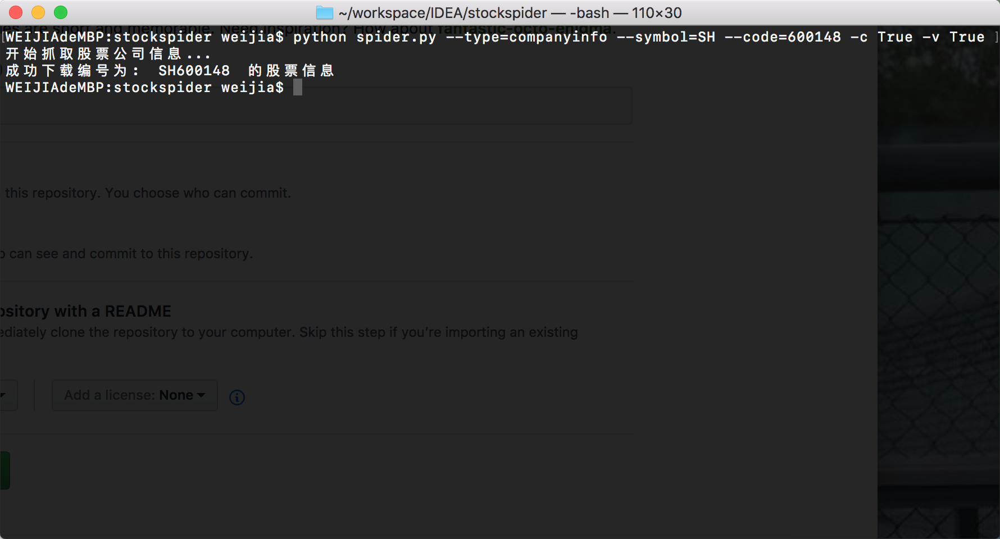
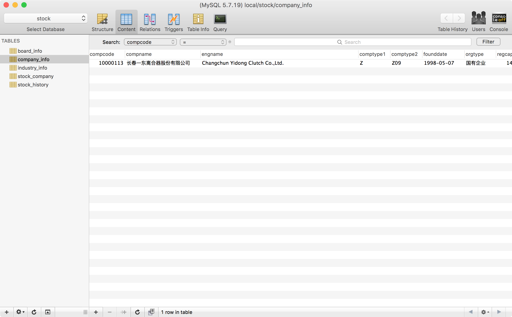
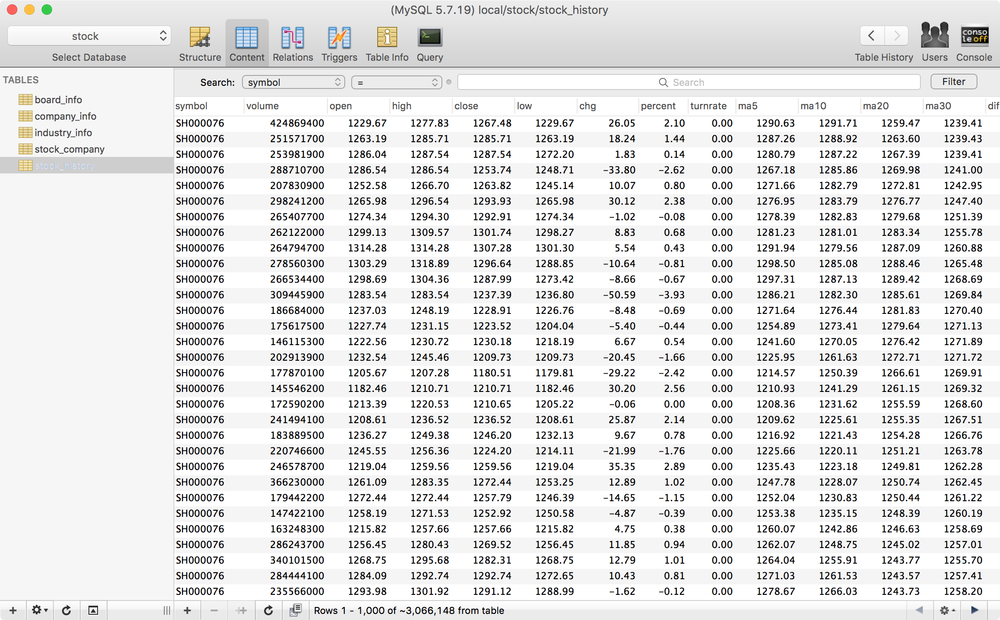

# Python Learning for Stock Spider

Author:[严唯嘉](http://www.yanweijia.cn)
DataSource: 雪球 https://xueqiu.com/

## 使用说明:
使用 python spider.py --help 来获取帮助信息
```$xslt
[weijia$]  python spider.py --help
 stock_spider 使用方法:
	 使用前请先修改config.py文件,确保数据库可以正确连接,使用的是单线程,如果需要多线程提高效率请实现自行实现thread,高速爬取可能会造成服务器屏蔽ip,可以使用代理,每个代理进入页面渲染后生成对应的cookie.
 参数说明:
	 --type 爬取种类, companyinfo 为公司信息(默认),stockhistory 为股票历史数据, stockrealtime 为股票实时数据
	 --symbol=SH 为上证,SZ为深证,默认SH
	 -s 股票区间开始代码,默认000000,这里从600000开始爬取
	 -e 股票区间结束代码,默认999999,这里到600299结束
	 -c 是否删除并清空所有数据表重建,默认 False
	 -v 是否验证https链接,默认False
	 --code=600148  爬取SH600148的信息,仅爬取当前股票,会忽略-s -e 参数
 爬取公司信息:
	 python spider.py --type=companyinfo --symbol=SH --code=600148 -c False -v True
	 或 python spider.py --type=companyinfo --symbol=SH -s 600000 -e 602999 -c False -v True
 爬取股票历史信息:
	 python spider.py --type=stockhistory --symbol=SH --code=600148 -c False -v True
	 或 python spider.py --type=stockhistory --symbol=SH -s 600000 -e 600299 -c False -v True
 爬取股票实时信息:
	 python spider.py --type=stockrealtime --symbol=SH --code=600148 -c False -v True
	 或 python spider.py --type=stockrealtime --symbol=SH -s 600000 -e 600299 -c False -v True
```




